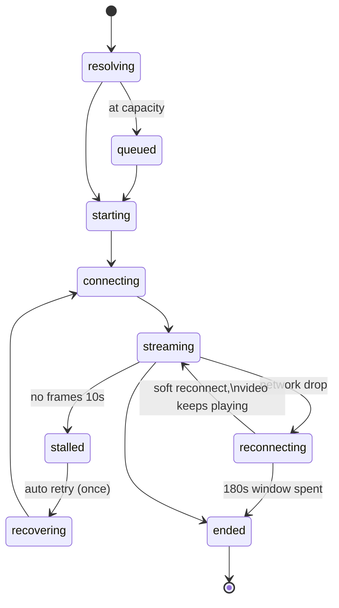

# Streampixel SDK Example (v2 — `@streampixel/core`)

A complete reference integration of the **Streampixel Web SDK v2** in React,
demonstrating every SDK capability: authentication (public / password / SSO /
programmatic), the typed state machine, queueing, automatic reconnection,
live stats, quality switching, AFK handling, on-screen keyboard, voice/text
chat, shared (SFU) viewing, UE messaging, and developer tooling.

The SDK is **headless** — every pixel of UI in this app (loading screen,
password gate, chat panel, controls…) is example code in
[src/components/App.js](src/components/App.js) that you own. Copy it, restyle
it, or replace it entirely; the SDK only provides events and methods.

---

## ⚡ Your first stream in 60 seconds

**No build tools.** The entire integration is one call:

```html
<div id="app" style="position:fixed;inset:0"></div>
<script type="module">
  import { StreamPixel } from '@streampixel/core';

  const stream = await StreamPixel.create({
    appId: 'YOUR_PROJECT_ID',                  // from the Streampixel dashboard
    container: document.getElementById('app'), // video mounts here
    loading: true,                             // branded loading screen built in
  });

  stream.on('state', (s) => console.log(s.kind));
</script>
```

That's a production-grade session: authentication, GPU placement, queueing,
reconnection and telemetry are all inside `create()`.

Try it right now: **[public/examples/minimal.html](public/examples/minimal.html)**
is exactly this, runnable without npm:

```bash
npx serve public
# → http://localhost:3000/examples/minimal.html?appId=YOUR_PROJECT_ID
```

Then graduate: minimal.html → this app (`src/components/App.js`, the full
custom-UI reference) → the tables below when you need every option.

---

## Table of contents

1. [Quick start](#quick-start)
2. [How a session works](#how-a-session-works)
3. [Packages](#packages)
4. [`StreamPixel.create()` — all options](#streampixelcreate--all-options)
5. [States](#states)
6. [Events](#events)
7. [Methods & properties](#methods--properties)
8. [Authentication & `AuthError`](#authentication--autherror)
9. [Disconnect codes](#disconnect-codes)
10. [Voice / text / video chat](#voice--text--video-chat)
11. [Shared (SFU) viewing](#shared-sfu-viewing)
12. [Upgrading from v1](#upgrading-from-v1)
13. [Telemetry & privacy](#telemetry--privacy)
14. [Local SDK development](#local-sdk-development)
15. [Troubleshooting](#troubleshooting)

---

## Quick start

```bash
npm install
npm start
# open http://localhost:3000/<projectId>      (or /?appId=<projectId>)
```

`<projectId>` is your project id from the Streampixel dashboard.

### URL parameters (this example app)

| Param | Meaning |
|---|---|
| `?platform=staging` | Target the staging control plane (default is **production**) |
| `?shared=host` | Shared (SFU) viewing — host role: owns the session and input |
| `?shared=viewer&hostStreamerId=<id>` | Watch a host's session (watch-only, enforced server-side) |
| `?streamerId=<id>` | Pin a specific streamer (session affinity) |

---

## How a session works

Understanding the flow makes every event self-explanatory:

```
create()
  1. GET  /api/v1/stream/access/<projectId>      → access mode (public/password/sso), branding
  2. POST /api/v1/stream/ticket                  → { ticket, telemetryToken, voiceToken?, config }
     · the TICKET is a short-lived signed credential — no API keys in the browser, ever
     · config carries your full dashboard configuration + the signalling host
  3. wss://<signalling>/?...&ticket=…            → session enqueued → placed on a GPU worker
  4. app launches → WebRTC negotiation → frames
```

The SDK owns steps 2–4 including every failure path: queueing, reconnection
with backoff (up to **180 s**, and a *soft* reconnect that keeps video playing
through signalling blips), a frozen-stream watchdog (10 s, one transparent
session retry), and a fail-fast for WebRTC-blocking corporate networks (~8 s,
clear error instead of an infinite spinner). Your app only *renders* states.

---

## Packages

| Package | What it is | In this app |
|---|---|---|
| `@streampixel/core` | Headless engine: auth/tickets, signalling, WebRTC, resilience, telemetry, typed events | everywhere |
| `@streampixel/core/voice` | Voice/text/video chat (LiveKit). Separate entry — never bundled unless imported | chat panel (💬) |
| `@streampixel/ui` | Drop-in overlays (`mountUI(stream, {container})`) for integrations without custom UI | not used — this app IS the custom-UI reference |

---

## `StreamPixel.create()` — all options

```js
const stream = await StreamPixel.create({
  /* ── Required (one of) ─────────────────────────────────────────────── */
  appId: 'PROJECT_ID',        // omit only on a verified custom domain
  container: element,         // where the <video> mounts; omit = headless, attach() later

  /* ── Authentication (default: { mode:'auto' }) ─────────────────────── */
  auth: { mode: 'auto' },                          // access mode decides; SSO auto-redirects
  //    { mode: 'password', password: '…' }        // password-gated projects
  //    { mode: 'sso', redirect: 'manual' }        // get AuthError.ssoStartUrl instead of auto-redirect
  //    { mode: 'ticket', ticket: mintResponse }   // programmatic: YOUR backend minted the ticket

  /* ── Shared (SFU) viewing (default: private 1:1) ───────────────────── */
  shared: { role: 'host' },                        // or { role:'viewer', hostStreamerId }

  /* ── Stream overrides (default: your dashboard config) ─────────────── */
  codec:      { primary: 'AV1'|'H264'|'VP9'|'VP8', fallback: 'H264'|'VP8' },
  resolution: { start: '1080p (1920x1080)' | {width,height},
                max: …, mobileStart: …, tabletStart: …,
                mode: 'fixed' | 'dynamic' },       // dynamic = follows window size
  bitrate:    { min: number, max: number },        // bps
  input:      { mouse, keyboard, touch, hover, gamepad, xr, fakeMouseWithTouches }, // booleans
  media:      { mic: boolean, camera: boolean },   // prompts for permission + unmutes
  afk:        { timeoutSec: number },

  /* ── Built-in minimal loading overlay (default: false) ─────────────── */
  loading: true,              // project banner/logo/texts until first frame

  /* ── Telemetry (default: 'standard'; never third-party) ────────────── */
  telemetry: 'standard' | 'minimal',

  /* ── Advanced ──────────────────────────────────────────────────────── */
  advanced: {
    platformHost:  'https://platform.streampixel.io',   // staging/on-prem override
    telemetryHost: 'https://telemetry.streampixel.io',
    streamerId:    'uuid',                               // session affinity
    iceTransportPolicy: 'all' | 'relay',                 // expert: force TURN
  },
});
```

`create()` **throws `AuthError`** when access is the problem (see
[Authentication](#authentication--autherror)) and resolves once the session is
admitted and connecting.

---

## States

Subscribe once; render everything from this:

```js
stream.on('state', (s) => { … });
```



| `s.kind` | Meaning | Recommended UX |
|---|---|---|
| `resolving` | Access + ticket mint in flight | "Authorizing…" |
| `queued` | Capacity queue; `s.position` | Queue badge (live `queue` events too) |
| `starting` | Admitted; app launching on a GPU worker | Loading progress |
| `connecting` | WebRTC negotiation | Loading progress |
| `streaming` | Frames flowing | Hide loading, show controls |
| `stalled` | Connected but no frames for 10 s (`s.sinceMs`) | Nothing — SDK auto-recovers |
| `recovering` | Transparent fresh-session retry after a stall | "Restarting…" |
| `reconnecting` | Network drop; `s.attempt`, `s.deadlineMs` | "Reconnecting…" (video often keeps playing — soft reconnect) |
| `ended` | Final. `s.code`, `s.reason`, `s.endKind` | Goodbye card by `endKind` |

`endKind` is `'user' | 'afk' | 'server' | 'error' | 'network-blocked'`.

---

## Events

| Event | Payload | Fires |
|---|---|---|
| `state` | `StreamState` (table above) | every transition |
| `queue` | `{ position, message }` | queue position updates |
| `stats` | `{ fps, latencyMs, bitrateKbps, resolution, codec, framesDecoded, framesDropped, relayTransport }` | every 1 s while streaming |
| `stalled` | full WebRTC diagnostics | watchdog fired (recovery already running) |
| `afkWarning` | `{ kind:'countdown', secondsRemaining, dismiss() }` or `{ kind:'dismissed' }` | idle countdown |
| `osk` | `{ contents }` | UE focused a text field — reply with `sendTextboxEntry()` |
| `ueMessage` | raw message | UE → browser (`handle_responses`) |
| `ended` | `{ code, reason, endKind }` | session over |

`relayTransport` (`'' \| 'udp' \| 'tcp' \| 'tls'`) tells you when the viewer is
on a restricted network (TCP/TLS relay) — show a quality notice.

---

## Methods & properties

```js
/* Input / UE */
stream.send({ any: 'json' });              // → UE (emitUIInteraction)
stream.consoleCommand('stat fps');         // UE console command
stream.sendTextboxEntry('typed text');     // answer an `osk` event
stream.setHoverMouse(true);                // hover vs locked mouse
stream.toggleXR();                         // WebXR (when project enables it)

/* Presentation */
stream.attach(container);                  // (re)mount the <video>
stream.setResolution(1920, 1080);
stream.allowedResolutions;                 // the project's ladder (for pickers)
stream.toggleAudio();                      // → returns true when audible

/* Introspection */
stream.state;                              // current StreamState
stream.streamConfig;                       // full dashboard config + branding
stream.projectId;                          // resolved project id
stream.streamerId;                         // this session's wire id (share for SFU)
stream.voiceToken;                         // present iff chat is enabled
await stream.getDiagnostics();             // WebRTC snapshot + human verdict
stream.captureScreenshot();                // PNG data URL of the current frame

/* Lifecycle */
stream.disconnect();                       // deliberate end — never auto-reconnects
```

---

## Authentication & `AuthError`

```js
try {
  stream = await StreamPixel.create({ appId });
} catch (err) {
  if (err instanceof AuthError) {
    switch (err.kind) {
      case 'password-required': /* show password form                    */ break;
      case 'password-wrong':    /* wrong password — show error, retry    */ break;
      case 'sso-required':      /* manual mode: navigate err.ssoStartUrl */ break;
      case 'project-offline':   /* owner turned it off / no build        */ break;
      case 'project-not-found': /* bad link                              */ break;
      case 'programmatic-only': /* must mint server-side                 */ break;
      case 'network':           /* platform unreachable                  */ break;
    }
  }
}
// password retry:
StreamPixel.create({ appId, auth: { mode: 'password', password } });
```

- **Public** projects mint anonymously — no code needed.
- **SSO** projects with the default `auto` mode redirect to the IdP and resume
  automatically with the single-use grant on return. Zero SSO code here.
- **Programmatic**: your backend calls `POST /api/v1/stream/ticket` with its
  API credentials and hands the response to the browser. The SDK never sees an
  API key — the short-lived ticket is the only client credential.

This app's password gate (with error handling) is in `App.js` →
`handlePasswordSubmit`.

---

## Disconnect codes

`ended.code` uses the platform's stable vocabulary — build UX on these:

| Code | Meaning | SDK behaviour |
|---|---|---|
| 1000 | Clean close | final |
| 1006 | Network drop | auto-reconnects first; 1006 surfaces only if the window is spent |
| 1008 | Ticket rejected / unauthorized | final (retrying can't help) |
| 4000 | Session terminated (admin/API) | final |
| 4002 | Application not found on worker | final |
| 4003 | Application failed to launch | final |
| 4004 | Max runtime reached | final |
| 4005 | App never connected (timeout) | final |
| 4006 | App disconnected mid-session | final |
| 4007 | Reconnect window exhausted | final (`endKind:'error'`) |
| 4008 | Session setup failed | final |

---

## Voice / text / video chat

Available when the ticket carries a `voiceToken` (chat enabled in the
dashboard). LiveKit is only downloaded when this module is imported:

```js
import { VoiceChat } from '@streampixel/core/voice';

const chat = VoiceChat.for(stream, {
  userName: 'Alice',
  avatar: 'https://…/alice.png',   // optional
  voice: false,                    // join muted (text-only); true opens the mic
});
await chat.join();

chat.on('message', ({ from, text, avatar }) => …);
chat.on('roster', ({ localParticipant, remoteParticipants }) => …);
//   each participant: { id, avatar, speaking, micMuted, videoTrack|null }
chat.on('typing', ({ from }) => …);
chat.on('deviceError', ({ message }) => …);   // mic/camera denied, in use, missing

chat.sendMessage('hi');
chat.sendTyping();                       // lossy; receivers clear on timeout
await chat.toggleMic(true);              // resolves false if the mic didn't come up
await chat.toggleCamera(true);           // VIDEO CHAT: then render roster videoTracks
chat.setRemoteAudio(false, identity?);   // local moderation: mute someone / everyone
await chat.leave();
```

Video chat = `toggleCamera(true)` + attaching each roster entry's
`videoTrack` to a `<video>` element (LiveKit track: `track.attach()`).

The 💬 button in this app demonstrates lazy join, messages, typing indicators
and mic toggle — and interops with share.streampixel.io viewers in the same
room.

---

## Shared (SFU) viewing

One UE instance, many watchers. The host owns input; viewers are watch-only
(server-enforced, and input is disabled locally too):

```js
// Host page
const host = await StreamPixel.create({ appId, container, shared: { role: 'host' } });
sendToViewers(host.streamerId);          // however your app distributes it

// Viewer pages
await StreamPixel.create({ appId, container,
  shared: { role: 'viewer', hostStreamerId } });
```

In this app: `/projectId?shared=host`, then
`/projectId?shared=viewer&hostStreamerId=<host's streamerId>`.

---

## Upgrading from v1

### Drop-in compatibility bridge

v1 code listened to raw Epic events. Core exposes the same surface so old
integrations port **without rewriting event code**:

```js
// v1-style — still works on the v2 instance:
stream.addEventListener('webRtcConnected', () => …);
stream.addEventListener('playStream', () => …);
stream.addEventListener('afkWarningActivate', (e) => …);
stream.addResponseEventListener('handle_responses', (response) => …);
stream.emitUIInteraction({ … });
stream.emitConsoleCommand('stat fps');
```

The bridge survives the SDK's internal reconnect rebuilds (v1 never had
those). New code should prefer the typed `on('state'|…)` surface — it's the
documented, stable contract.

### What changed

| v1 | v2 |
|---|---|
| `StreamPixelApplication({...})` returns Epic internals | `StreamPixel.create({...})` returns a typed facade |
| API key + config from legacy endpoints | Server-minted **ticket**; no secrets in the browser |
| Reconnect/queue/AFK re-implemented by every integrator | Built into the SDK; you render states |
| Mixpanel bundled | First-party telemetry only |
| `sfuHost: 'false'` string flags | Typed `shared: { role }` |
| Obfuscated bundle | Readable TS + sourcemaps; integrity via immutable npm versions & CDN SRI |

---

## Telemetry & privacy

The SDK reports session lifecycle + WebRTC quality to Streampixel's own
pipeline, authenticated with a session-scoped token from the ticket
(`telemetry: 'minimal'` restricts to lifecycle events). **No third-party
trackers, no cookies, no analytics SDKs.** These reports are what make
sessions debuggable in the dashboard when a viewer reports a problem.

---

## Local SDK development

This repo consumes the SDK from a **vendored tarball**
(`vendor/streampixel-core-*.tgz`) so a fresh clone builds before the packages
hit npm. To develop SDK and example side by side:

```bash
cd ../SDK-GENERATOR/packages/core
# 1. edit src/…  2. bump the prerelease (cache-busting is mandatory):
npm version 2.0.0-alpha.<n+1> --no-git-tag-version
npm run build && npm pack --pack-destination /tmp
cp /tmp/streampixel-core-*.tgz ../../../Streampixel-SDK-Example/vendor/
cd ../../../Streampixel-SDK-Example
rm vendor/<old>.tgz && npm install ./vendor/streampixel-core-<new>.tgz
```

> **Always bump the version when the tarball changes** — npm, Vercel and CI
> all cache by name+version; identical versions with different bytes produce
> stale installs (exactly the "`./voice` is not exported" Vercel failure).

Once v2 publishes to npm, the `file:` dep becomes a normal version range.

---

## Troubleshooting

- **Black container, no loading UI** — you built custom UI and aren't
  rendering `state`, or pass `loading: true` for the SDK's minimal overlay.
- **`ws://localhost:3000/ws` in devtools** — webpack hot reload, not the SDK.
  The SDK's socket is `wss://<region-signalling>/?...&ticket=…`.
- **Red telemetry rows under DevTools throttling** — telemetry has a hard
  1.5 s timeout so it can never slow the stream; aborts under throttling are
  by design.
- **Chat button missing** — project has chat disabled (no `voiceToken`), or
  the stream hasn't reached `streaming` yet.
- **`osk` never fires** — the UE app must use Pixel Streaming's text-input
  widgets.
- **Stuck in `queued`** — project at its concurrency limit; the `queue`
  events carry the live position.
- **`ended` with `network-blocked`** — the viewer's network blocks UDP *and*
  TURN relay; the reason text includes remediation (allow `*.turn.twilio.com`
  on TCP/443).
- **1008 immediately on connect** — domain-restricted project: the embedding
  origin isn't in the project's allowed domains.
